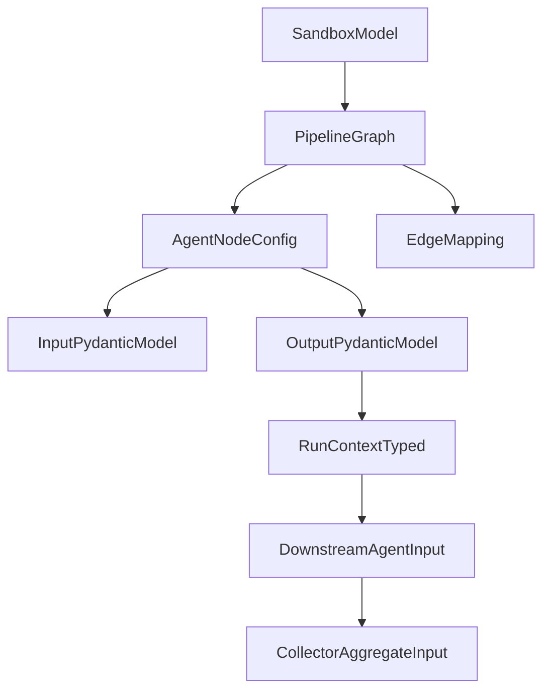
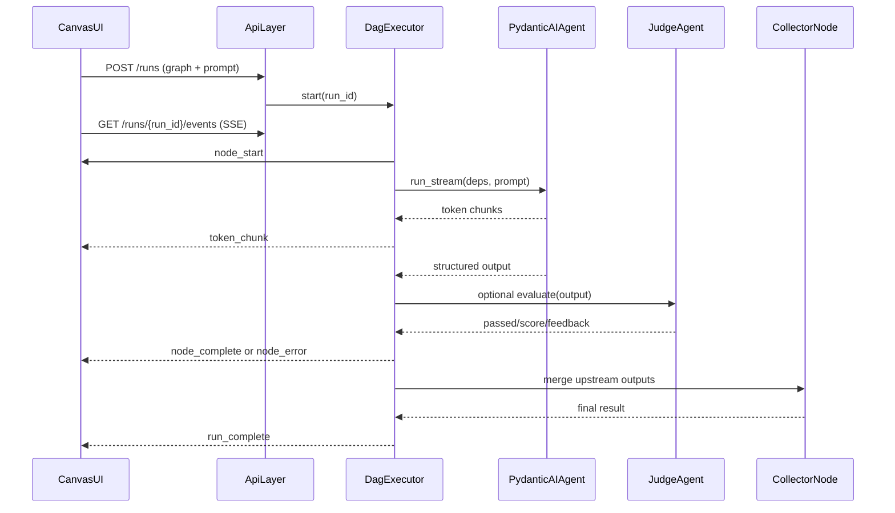
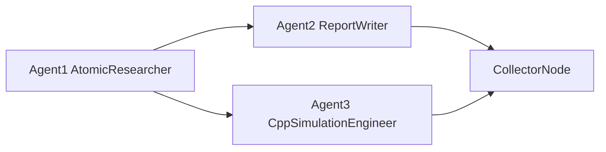
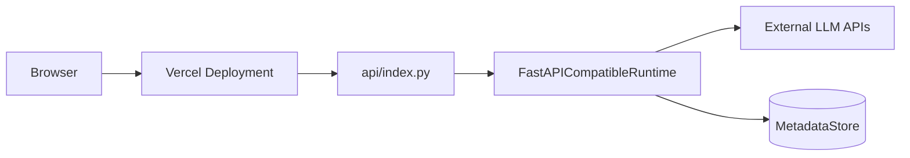

# AgentCanvas Architecture

This document describes the project architecture based on `IDEA.md`, with **Architecture C** as the long-term target and a **Vercel-compatible MVP runtime** for hackathon delivery.

## 1) Architecture Decision

- **Long-term target:** `FastAPI + PydanticAI + WebSockets` (Architecture C)
- **MVP deployment mode:** `Vercel-first + SSE + Pydantic contracts`
- **Why:** keep typed multi-agent orchestration from Architecture C while minimizing runtime and deployment risk for the hackathon requirement (live on Vercel)

## 2) High-Level System

```mermaid
flowchart LR
  User[User] --> CanvasUI[CanvasUI ReactFlow]
  CanvasUI -->|POST /runs| ApiLayer[VercelApiLayer]
  CanvasUI -->|GET /runs/{run_id}/events| EventStream[SSEEventStream]
  ApiLayer --> DagExecutor[DagExecutor Async]
  DagExecutor --> PydanticAgents[PydanticAIAgents]
  PydanticAgents --> LLMProviders[LLMProviders]
  DagExecutor --> RunStore[RunState Store]
  RunStore --> EventStream
  DagExecutor --> Collector[CollectorNode]
  Collector --> CanvasUI
```

## 3) Frontend Architecture

- **Framework/UI:** React + Vite + ReactFlow (XY Flow) + Zustand + Tailwind
- **Core screens/components:**
  - Sandbox list / selector
  - Canvas editor (nodes, edges, mappings)
  - Node configuration drawer (role, model, input/output schema, tools)
  - Global context panel
  - Run monitor panel (live status + streamed tokens + errors)
  - Collector output panel
- **Client responsibilities:**
  - Build and validate graph payload before run
  - Send `POST /runs` to start execution
  - Subscribe to streaming events over SSE
  - Map events to node UI state (`idle`, `running`, `done`, `error`)
  - Persist local editing state and render typed previews

## 4) Backend Architecture

- **Runtime:** Python FastAPI-compatible application exposed via Vercel API entrypoint for MVP
- **Orchestration:**
  - Homegrown DAG executor
  - Topological ordering
  - Parallel execution of independent branches (`asyncio.gather`)
  - Collector merge pass at pipeline completion
- **Agent layer:**
  - PydanticAI agents generated from node definitions
  - Per-node model config and system prompt
  - Typed `output_type` for every node
  - Optional MCP tool assignment per node
- **Validation and quality:**
  - Pydantic schema validation on inbound graph and node outputs
  - Optional LLM Judge nodes for scoring/retry gates
- **State/storage:**
  - MVP: in-memory run-state + persisted metadata where available
  - Target: PostgreSQL/SQLModel for sandboxes, graph metadata, run history, snapshots

## 5) API Surface

### Core Endpoints (MVP)

- `POST /runs`
  - Input: sandbox id, prompt, graph
  - Output: `run_id`
- `GET /runs/{run_id}/events`
  - SSE stream of run events
- `GET /runs/{run_id}`
  - Run snapshot and final outputs
- `GET /health`
  - Service health check

### Event Contract

```json
{ "type": "node_start", "node_id": "agent_1" }
{ "type": "token_chunk", "node_id": "agent_1", "chunk": "..." }
{ "type": "node_complete", "node_id": "agent_1", "output": {} }
{ "type": "node_error", "node_id": "agent_1", "error": "..." }
{ "type": "run_complete", "collector_output": {} }
```

This event protocol is intentionally transport-agnostic so SSE can later be swapped for WebSockets without frontend state-model rewrites.

## 6) Data and Type Model (Pydantic-First)



### Core model groups

- **Graph models:** sandbox, nodes, edges, collector, context
- **Execution models:** run request, run status, per-node result, run snapshot
- **Agent contracts:** typed input/output Pydantic models per node
- **Judge contracts:** verdict model (`passed`, `score`, `feedback`)

## 7) Execution Flow (Architecture C Semantics)



## 8) Example Workflow (from IDEA.md)



### Node responsibilities

- `Agent1 AtomicResearcher`
  - Produces structured research summary
- `Agent2 ReportWriter`
  - Produces academic-style markdown report from research output
- `Agent3 CppSimulationEngineer`
  - Produces compilable and commented C++ simulation code
- `CollectorNode`
  - Assembles report + simulation + summary into final output artifact

## 9) WebSockets vs SSE Decision

- **Current choice (MVP):** SSE
  - lower implementation complexity
  - robust for one-way server-to-client streaming
  - enough for live node status + token output
- **Switch to WebSockets when:**
  - bidirectional runtime control is needed (`pause`, `resume`, `cancel`, `human-in-the-loop` interrupts)
  - multi-user collaborative real-time editing is introduced

## 10) Deployment Topology

### MVP (Hackathon / Vercel)



- Frontend and API are exposed through Vercel routes
- Run-time limits require scoped runs and efficient event streaming

### Long-term (Full Architecture C)

- Dockerized FastAPI service
- Optional worker split for higher throughput
- WebSockets transport upgrade
- Persistent checkpointing and richer observability

## 11) Non-Functional Requirements

- **Reliability:** typed validation at every node boundary
- **Observability:** per-node status and error events; run snapshots
- **Performance:** parallel branch execution where DAG permits
- **Security:** API key management through environment variables, auth for sandbox access
- **Portability:** same core executor and contracts across Vercel MVP and Docker FastAPI target

## 12) Risks and Mitigations

- **Vercel runtime limits:** keep runs bounded; persist intermediate outputs
- **Streaming interruptions:** reconnection strategy + snapshot endpoint
- **Complexity growth:** enforce stable event schema and typed contracts
- **LLM variability:** judge nodes and retry guardrails for critical stages

## 13) Migration Plan

1. Keep API/event contracts unchanged.
2. Move execution host from Vercel runtime to Dockerized FastAPI.
3. Introduce WebSockets for bidirectional control if needed.
4. Add persistent checkpoints and resumability.
5. Expand judge/MCP capabilities per node.

