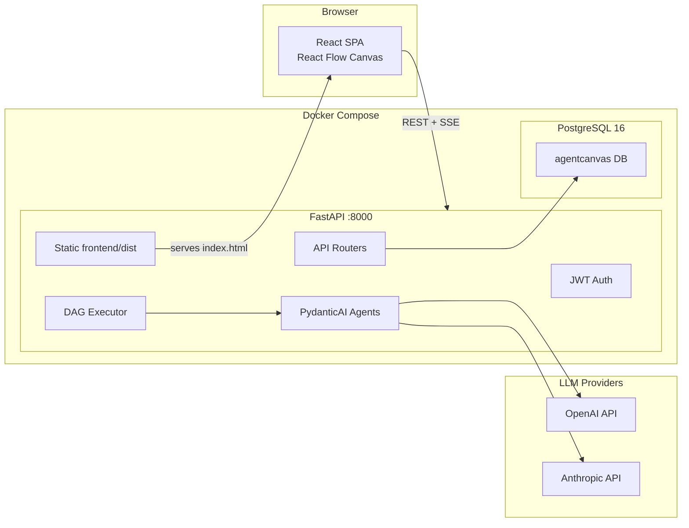
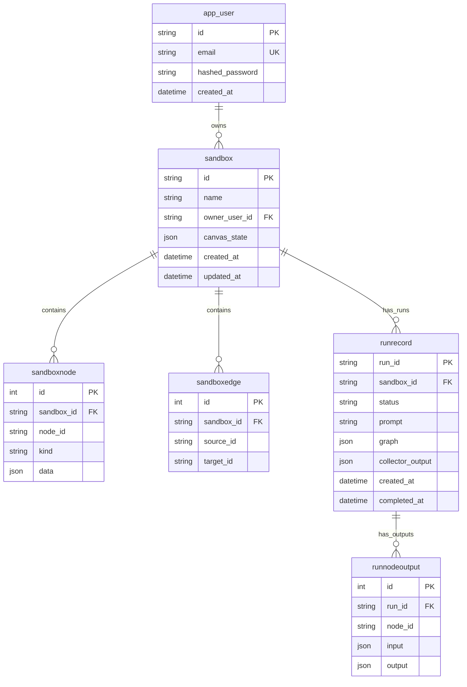
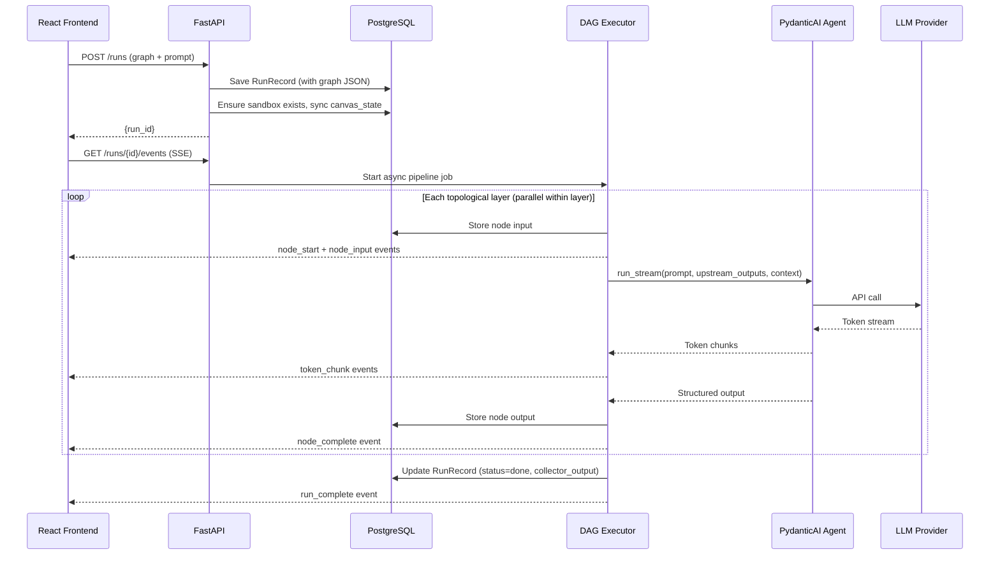

# AgentCanvas

A visual, browser-based multi-agent orchestration platform. Users build AI pipelines by dragging agent nodes onto an infinite canvas, wiring them together as a directed acyclic graph (DAG), and executing the pipeline in real time. Each agent node carries its own LLM provider, model, role prompt, and output configuration. Upstream agent outputs flow into downstream agents automatically. A collector node assembles the final result. The entire execution streams live to the UI via Server-Sent Events.

## Architecture Overview



## Tech Stack

| Layer | Technologies |
|-------|-------------|
| **Frontend** | React 18, TypeScript, Vite 5, React Flow (XY Flow), Zustand, Tailwind CSS, react-router-dom |
| **Backend** | Python 3.12, FastAPI, PydanticAI (slim, OpenAI + Anthropic), Pydantic, Uvicorn |
| **Database** | PostgreSQL 16 (Docker), SQLite (local fallback), SQLModel, Alembic |
| **Auth** | JWT (python-jose), passlib (pbkdf2_sha256) |
| **Infrastructure** | Docker, Docker Compose, Vercel (serverless alternative) |

## Project Structure

```
agentcanvas/
├── frontend/                        # React SPA
│   ├── src/
│   │   ├── pages/                   # LoginPage, SignupPage
│   │   ├── components/              # Toolbar, FlowCanvas, Inspector, Palette, EventsLog, Toast
│   │   ├── nodes/                   # AgentNode, CollectorNode (React Flow custom nodes)
│   │   ├── stores/                  # authStore, canvasStore, runStore (Zustand)
│   │   ├── lib/                     # api.ts (authFetch, sseUrl), graph.ts (validation)
│   │   ├── App.tsx                  # Routing: /login, /signup, / (protected)
│   │   └── main.tsx                 # BrowserRouter entry point
│   ├── vite.config.ts               # Dev server proxy to backend
│   └── tailwind.config.js           # Custom canvas-* color tokens
│
├── backend_or_api/                  # FastAPI application
│   ├── app/
│   │   ├── main.py                  # App factory, lifespan, CORS, static serving, SPA catch-all
│   │   ├── config.py                # Settings via pydantic-settings (.env)
│   │   ├── database.py              # Engine, Alembic init_db(), session generator
│   │   ├── db_models.py             # SQLModel tables (User, Sandbox, RunRecord, etc.)
│   │   ├── deps.py                  # Auth dependencies, AUTH_DISABLED bypass
│   │   ├── auth_utils.py            # JWT encode/decode, password hashing
│   │   ├── graph_validate.py        # DAG cycle detection, graph validation
│   │   ├── graph_sync.py            # Sync canvas_state JSON to normalized node/edge rows
│   │   ├── state.py                 # In-memory SSE event log and tick queues
│   │   ├── routers/                 # auth, sandboxes, runs, graph, health, meta
│   │   ├── models/                  # Pydantic schemas (auth, graph, run, sandbox, judge)
│   │   ├── services/                # DAG topological sort, executor with parallel branches
│   │   ├── agents/                  # BaseSandboxAgent, PydanticAI agent wrapper, LLM clients
│   │   ├── judges/                  # LLM judge service, verdict parser
│   │   └── pai/                     # PydanticAI Agent/Model builders
│   ├── alembic/                     # Migration env + version scripts
│   ├── requirements.txt             # Runtime Python dependencies
│   └── requirements-dev.txt         # Dev dependencies (pytest, httpx)
│
├── api/index.py                     # Vercel serverless entry point (re-exports FastAPI app)
├── schemas/run_request.schema.json  # JSON Schema for run payload documentation
├── tests/                           # pytest test suite
├── docs/                            # Supplementary documentation
│   ├── ARCHITECTURE.md              # Architecture decisions and diagrams
│   ├── CHALLENGE.md                 # Hackathon challenge brief and rubric
│   └── IDEA.md                      # Original concept document and architecture proposals
│
├── Dockerfile                       # Multi-stage: Node (frontend build) + Python (API)
├── docker-compose.yml               # PostgreSQL + app service
├── alembic.ini                      # Alembic config (points to backend_or_api/alembic)
├── vercel.json                      # Vercel route config
├── pyproject.toml                   # Python project metadata
└── .env.example                     # Environment variable template
```

## Getting Started

### Prerequisites

- Docker and Docker Compose (recommended), **or** Python 3.10+ and Node.js 20+
- At least one LLM API key: `OPENAI_API_KEY` or `ANTHROPIC_API_KEY`

### Option A: Docker (recommended)

1. Copy the environment template and add your API key(s):

   ```bash
   cp .env.example .env
   # Edit .env and set OPENAI_API_KEY and/or ANTHROPIC_API_KEY
   ```

2. Build and start:

   ```bash
   docker compose up --build
   ```

3. Open [http://localhost:8000](http://localhost:8000). You will see the signup page. Create an account and start building pipelines.

The multi-stage Dockerfile builds the React frontend with Node.js, then copies the compiled `dist/` into a Python 3.12 image that serves both the API and the static frontend. Alembic migrations run automatically on startup.

### Option B: Local Development (Python + Vite)

1. Start the backend:

   ```bash
   cp .env.example .env
   # Edit .env — set API keys and optionally AUTH_DISABLED=1 for convenience
   python -m venv .venv
   .venv\Scripts\activate        # Windows
   # source .venv/bin/activate   # macOS/Linux
   pip install -r backend_or_api/requirements.txt
   uvicorn backend_or_api.app.main:app --reload
   ```

   Without `DATABASE_URL`, the API uses a local SQLite file (`agentcanvas.db`).

2. Start the frontend dev server (separate terminal):

   ```bash
   cd frontend
   npm install
   npm run dev
   ```

   Vite runs on port 5173 and proxies API routes (`/runs`, `/health`, `/sandboxes`, `/auth`, `/graph`, `/providers`, `/models`, `/docs`, `/openapi.json`) to the backend at `localhost:8000`.

3. Open [http://localhost:5173](http://localhost:5173).

## Environment Variables

| Variable | Required | Default | Description |
|----------|----------|---------|-------------|
| `OPENAI_API_KEY` | One of OpenAI/Anthropic | — | OpenAI API key for agent execution |
| `ANTHROPIC_API_KEY` | One of OpenAI/Anthropic | — | Anthropic API key for agent execution |
| `DEFAULT_OPENAI_MODEL` | No | `gpt-4o-mini` | Default model when an OpenAI node omits `model` |
| `DEFAULT_ANTHROPIC_MODEL` | No | `claude-sonnet-4-20250514` | Default model when an Anthropic node omits `model` |
| `DATABASE_URL` | No | `sqlite:///./agentcanvas.db` | PostgreSQL connection string (set automatically by docker-compose) |
| `JWT_SECRET` | Production | `dev-insecure-...` | Secret for signing JWTs. Change in production. |
| `JWT_EXPIRE_MINUTES` | No | `10080` (7 days) | Token expiration in minutes |
| `AUTH_DISABLED` | No | unset | Set to `1` to bypass JWT auth and auto-create a dev user |

## Authentication

AgentCanvas uses JWT-based authentication. The frontend provides login and signup pages that communicate with the backend auth endpoints.

**Flow:**

1. User registers via `POST /auth/register` or logs in via `POST /auth/login`
2. Backend returns an `access_token` (JWT signed with `JWT_SECRET`)
3. Frontend stores the token in `localStorage` (via Zustand persist middleware)
4. All subsequent API calls include `Authorization: Bearer <token>` (injected by the `authFetch` helper)
5. SSE connections (EventSource cannot set headers) use `?access_token=<token>` as a query parameter (built by the `sseUrl` helper)
6. On 401 responses, the frontend auto-clears the token and redirects to `/login`

**Development shortcut:** Set `AUTH_DISABLED=1` in your `.env` to bypass authentication entirely. The backend auto-creates a dev user (`dev@localhost.internal`) and uses it for all requests.

## API Reference

Interactive documentation is available at `/docs` (Swagger UI) and `/openapi.json` when the server is running.

### Auth

| Method | Path | Description |
|--------|------|-------------|
| `POST` | `/auth/register` | Create account. Body: `{email, password}` (min 8 chars). Returns `{access_token, token_type}` |
| `POST` | `/auth/login` | Sign in. Same body/response shape. |

### Sandboxes (authenticated)

| Method | Path | Description |
|--------|------|-------------|
| `POST` | `/sandboxes` | Create a sandbox. Body: `{name, description?}` |
| `GET` | `/sandboxes` | List your sandboxes |
| `GET` | `/sandboxes/{id}` | Get sandbox metadata |
| `PATCH` | `/sandboxes/{id}` | Update name/description |
| `DELETE` | `/sandboxes/{id}` | Delete sandbox and all related data |
| `GET` | `/sandboxes/{id}/graph` | Load saved pipeline graph |
| `PATCH` | `/sandboxes/{id}/graph` | Save pipeline graph (validates DAG, syncs node/edge projection) |
| `GET` | `/sandboxes/{id}/nodes` | List normalized node rows |
| `GET` | `/sandboxes/{id}/edges` | List normalized edge rows |
| `GET` | `/sandboxes/{id}/runs` | List run history for the sandbox |

### Runs (authenticated)

| Method | Path | Description |
|--------|------|-------------|
| `POST` | `/runs` | Start a pipeline run. Body: `{sandbox_id, graph, prompt}`. Auto-creates sandbox if needed. Returns `{run_id}` |
| `GET` | `/runs/{id}` | Get run snapshot (status, graph, inputs, outputs, collector output) |
| `GET` | `/runs/{id}/events` | SSE stream of execution events. Use `?access_token=<jwt>` for EventSource. |
| `POST` | `/runs/{id}/resume` | Resume a failed run from saved node outputs |

### Utility

| Method | Path | Description |
|--------|------|-------------|
| `GET` | `/health` | `{"status": "ok"}` |
| `GET` | `/providers` | Which LLM providers have API keys configured |
| `GET` | `/models/defaults` | Default model names per provider |
| `POST` | `/graph/validate` | Validate a pipeline graph and return topological layers |

## Database Schema

All tables are managed by Alembic migrations. The API runs `alembic upgrade head` automatically on startup.

| Table | Purpose | Key Columns |
|-------|---------|-------------|
| `app_user` | User accounts | `id` (PK), `email` (unique), `hashed_password`, `created_at` |
| `sandbox` | Workspaces / projects | `id` (PK), `name`, `owner_user_id` (FK -> app_user), `canvas_state` (JSON), `created_at`, `updated_at` |
| `sandboxnode` | Queryable node mirror | `sandbox_id` (FK -> sandbox), `node_id`, `kind`, `data` (JSON) |
| `sandboxedge` | Queryable edge mirror | `sandbox_id` (FK -> sandbox), `source_id`, `target_id` |
| `runrecord` | Pipeline execution records | `run_id` (PK), `sandbox_id` (FK -> sandbox), `status`, `prompt`, `graph` (JSON), `collector_output` (JSON), `created_at`, `completed_at` |
| `runnodeoutput` | Per-node execution data | `run_id` (FK -> runrecord), `node_id`, `input` (JSON), `output` (JSON) |

### Entity Relationships



## Frontend Architecture

### Routing

| Path | Component | Auth Required |
|------|-----------|---------------|
| `/login` | `LoginPage` | No |
| `/signup` | `SignupPage` | No |
| `/*` | `CanvasLayout` (protected) | Yes |

The `ProtectedRoute` wrapper checks `authStore.token` and redirects to `/login` if absent.

### Zustand Stores

| Store | Purpose |
|-------|---------|
| `authStore` | JWT token, user email, login/register/logout actions. Persisted to `localStorage` via Zustand's `persist` middleware. |
| `canvasStore` | React Flow nodes, edges, sandbox name, prompt, global context. Manages canvas interactions (add/remove/connect nodes). |
| `runStore` | Run state: `runId`, `isRunning`, per-node status (`idle`/`running`/`done`/`error`), streaming text, node outputs, SSE events log. |

### SSE Event Flow

When the user clicks "Run pipeline":

1. `Toolbar` calls `authFetch("POST /runs", {graph, prompt, sandbox_id})`
2. Backend validates the graph, creates a `RunRecord`, starts async DAG execution
3. `Toolbar` opens `EventSource(sseUrl("/runs/{id}/events"))` with the JWT token
4. Events stream in: `node_start` -> `token_chunk` (streaming text) -> `node_complete` -> `run_complete`
5. `runStore.applyEvent()` maps each event to UI state (node status badges, streaming text panels, output data)

## Pipeline Execution Flow



## Development

### Alembic Migrations

From the repository root:

```bash
# Check current migration version
python -m alembic current

# Apply all pending migrations
python -m alembic upgrade head

# Create a new migration after changing db_models.py
python -m alembic revision --autogenerate -m "describe your change"
```

The app also runs `upgrade head` automatically on startup, so migrations apply when Docker containers start.

### Running Tests

```bash
pip install -r backend_or_api/requirements-dev.txt
pytest
```

Integration tests that call real LLM APIs are marked with `@pytest.mark.integration` and require API keys in the environment.

### Integration Test

With the server running:

```bash
python _integration_test.py
```

This exercises health checks, sandbox CRUD, graph save/load, node/edge projection, run lifecycle, and cascade delete.

## Deployment

### Docker Compose (Production)

```bash
docker compose up --build -d
```

- PostgreSQL 16 with persistent volume (`pgdata`)
- Multi-stage image: Node.js builds the frontend, Python serves everything on port 8000
- Alembic migrations run on startup
- Set `JWT_SECRET` to a secure random string in `.env`

### Vercel (Serverless)

The repository includes `vercel.json` and `api/index.py` for Vercel deployment:

```bash
npx vercel
```

Set environment variables in the Vercel dashboard:

- `DATABASE_URL` (use Vercel Postgres, Neon, or Supabase)
- `JWT_SECRET`
- `OPENAI_API_KEY` and/or `ANTHROPIC_API_KEY`

Note: without an external PostgreSQL database, SQLite on Vercel does not persist across invocations.

## Additional Documentation

- [Architecture Decisions and Diagrams](docs/ARCHITECTURE.md)
- [Hackathon Challenge Brief and Rubric](docs/CHALLENGE.md)
- [Original Concept Document and Architecture Proposals](docs/IDEA.md)
